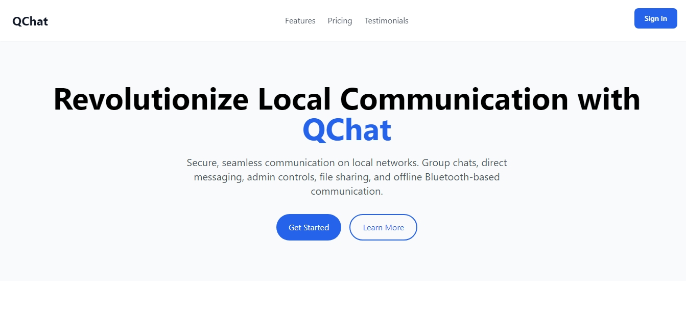

# QChat - Real-time Secure Network Chat



QChat is a secure, real-time chat application designed for local network communication. Built with modern web technologies and emphasizing security, it provides a seamless, encrypted chatting experience within your network.

## ✨ Key Features

### 💬 Messaging
- Real-time messaging with WebSocket encryption
- Message threading and replies
- Typing indicators and presence detection
- Rate limiting (5 messages/10 seconds)
- Support for messages up to 5000 characters

### 🛡️ Security
- End-to-end SSL/TLS encryption
- Message signing with HMAC-SHA256
- Input sanitization against XSS attacks
- Configurable CORS protection
- Rate limiting and spam prevention
- Secure user authentication

### 🎨 Interface
- Modern responsive design with Tailwind CSS
- Dark mode support
- Animated transitions and interactions
- User avatars
- Online/offline status indicators
- Mobile-friendly layout

## 🚀 Getting Started

### Prerequisites
- Node.js v14 or higher
- MongoDB
- SSL certificate and key
- npm or yarn
- Gmail account (for sending OTP emails)

### Installation Steps

1. Clone the repository
```bash
git clone https://github.com/GitCoder052023/QChat.git
cd QChat
```

2. Install dependencies
```bash
npm install
```

3. Configure environment
```bash
cp .env.example .env
```

### Database Setup

1. Install and start MongoDB
2. Open MongoDB Compass or shell
3. Create a new connection using: `mongodb://localhost:27017`
4. Create a new database named `QChat`
5. Inside QChat database, create these collections:
   - `Users` - Stores user accounts
   - `Messages` - Stores chat messages
   - `otps` - Stores OTP verification codes

### Gmail App Password Setup

1. Go to your Google Account settings
2. Navigate to Security → 2-Step Verification
3. At the bottom, select "App passwords"
4. Select "Other" as app and give it a name (e.g. "QChat")
5. Copy the generated 16-character password

### Environment Configuration

#### Update .env with your settings:
```env
HOST=YOUR_IP_ADDRESS
PORT=3000
SPORT=4000
NODE_ENV=development
MONGODB_URI=mongodb://localhost:27017/QChat
SSL_KEY=/path/to/key.pem
SSL_CERT=/path/to/cert.pem
JWT_SECRET=your_jwt_secret
EMAIL_USER=your.email@gmail.com
EMAIL_PASSWORD=your-16-char-app-password
```

### Start Development Server
```bash
npm run dev
```

## 🛠️ Development

### Available Scripts
- `npm run dev` - Start development server
- `npm run build:css` - Build Tailwind CSS
- `npm run lint` - Run ESLint
- `npm run format` - Format with Prettier

## 📝 Contributing

Please read our Contributing Guide and Code of Conduct before submitting pull requests.

## 🔒 Security

For security issues, please review our Security Policy and report vulnerabilities to hamdankhuabib959@gmail.com.

---

Built with ❤️ by Hamdan Khubaib
