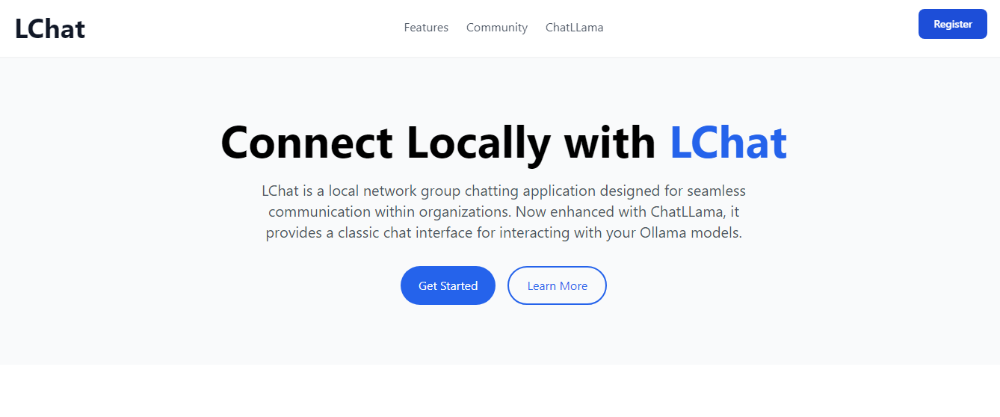

# StreamNet – Secure, Real-Time Chat for Local Networks with AI Support




StreamNet is a secure, real-time chat application designed for local network communications with integrated AI capabilities. Built with modern web technologies and a focus on security, StreamNet delivers a seamless, encrypted messaging experience tailored for your local network. Enjoy features like instant messaging, AI-powered conversations through ChatLLama, robust security protocols, and an intuitive design.

## Table of Contents
### Core Features
- [Key Features Overview](#-key-features)
  - [Messaging System](#-messaging)
  - [ChatLLama Integration](#-chatllama)
  - [Security Features](#️-security)
  - [User Interface](#-user-interface)

### Setup & Installation
- [Getting Started](#-getting-started)
  - [Prerequisites](#prerequisites)
  - [Installation Steps](#installation-steps)
  - [Environment Configuration](#environment-configuration)
  - [Start Development Server](#start-development-server)
  - [Accessing the Application](#accessing-the-application)

### Usage & Development
- [Using ChatLLama](#-using-chatllama)
- [Development](#️-development)
  - [Available Scripts](#available-scripts)

### Project Information
- [License](#-license)
- [Contributing](#-contributing)
- [Security](#-security)

## ✨ Key Features

### 💬 Messaging
- Real-time messaging powered by encrypted WebSockets.
- Message threading and reply functionality.
- Typing indicators and presence detection.
- Rate limiting: 5 messages per 10 seconds.
- Support for messages up to 5000 characters.

### 🤖 ChatLLama
- **Local AI Integration:** Chat with Ollama models running on your local network.
- **Real-Time Streaming:** Experience character-by-character AI responses powered by Socket.io.
- **Model Selection:** Choose from various Ollama models for different conversation needs.
- **Advanced Formatting:** Full markdown support with code syntax highlighting.
- **Streaming Controls:** Pause or stop AI responses at any time.
- **Conversation Management:** Auto-generated titles and searchable history.
- **Theme Customization:** Light, Dark, and System theme options.

### 🛡️ Security
- End-to-end SSL/TLS encryption.
- Message signing with HMAC-SHA256.
- Comprehensive input sanitization against XSS attacks.
- Configurable CORS protection.
- Built-in rate limiting and spam prevention.
- Secure user authentication.

### 🎨 User Interface
- Modern, responsive design built with Tailwind CSS.
- Dark mode support for comfortable viewing.
- Animated transitions and interactive UI elements.
- Customizable user avatars.
- Real-time online/offline status indicators.
- Mobile-friendly layout.

## 🚀 Getting Started

### Prerequisites
- Node.js v14 or higher
- MongoDB
- SSL certificate and key
- npm or yarn
- Gmail account for OTP email integration
- Ollama installed locally (for ChatLLama functionality)

### Installation Steps

1. **Clone the repository:**
   ```bash
   git clone https://github.com/GitCoder052023/StreamNet.git
   cd StreamNet
   ```

2. **Install dependencies:**
   ```bash
   npm install
   ```

3. **Configure the environment:**
   ```bash
   cp .env.example .env
   ```

4. **Database Setup:**
   - Install and start MongoDB.
   - Open MongoDB Compass or your shell.
   - Create a new connection using: `mongodb://localhost:27017`.
   - Create a database named `StreamNet` with the following collections:
     - `Users` – for user accounts.
     - `Messages` – for chat messages.
     - `otps` – for OTP verification codes.
     - `Conversations` – for ChatLLama conversation history.

5. **Gmail App Password Setup:**
   - Sign in to your [Google Account](https://myaccount.google.com/).
   - Navigate to Security → 2-Step Verification.
   - Under "App passwords," select "Other" and enter a label (e.g., "StreamNet").
   - Copy the generated 16-character password.

6. **Ollama Setup (for ChatLLama):**
   - Install Ollama from [ollama.ai](https://ollama.ai).
   - Pull your preferred models:
     ```bash
     ollama pull llama2
     ollama pull llama2-uncensored
     ollama pull mistral
     ```
   - Ensure Ollama is running before starting StreamNet.

### Environment Configuration

Update your `.env` file with your settings:

```env
PORT=3000
SPORT=4000
HOST="System will configure it automatically"
NODE_ENV=development
JWT_SECRET="your_secure_jwt_secret"
ALLOWED_ORIGINS="System will configure it automatically"
SSL_KEY="path to your ssl key"
SSL_CERT="path to your ssl cert"
SECRET_KEY="your_secure_secret_key"
TOKEN_EXPIRY="24h"
SALT_ROUNDS=10
EMAIL_USER="your_email_address"
EMAIL_PASSWORD="your_app_password"
MONGODB_URI=mongodb://localhost:27017/StreamNet
FRONTEND_ORIGIN="System will configure it automatically"
OLLAMA_API_URL="http://localhost:11434"
ChatLLama_MONGODB_URI="mongodb://localhost:27017/ChatLLama"
```

### Start Development Server
```bash
npm run dev
```

After running the development server, you'll see output similar to this:

```bash
[ChatLLama:start] ChatLLama app running on port http://192.168.1.5:3001
[start] Connected to MongoDB
[start] Engine is running on port 3000
[server] Connected to MongoDB
[server] Server is running on https://192.168.1.5:4000
[server] [NETWORK INTERFACE] - StreamNet is running on https://192.168.1.5:3000
[server] [LOCAL INTERFACE] - StreamNet is running on https://localhost:3000
[ChatLLama:server] ChatLLama Server running on port http://192.168.1.5:5000
[ChatLLama:server] MongoDB connected
```

### Accessing the Application

1. Open your browser and navigate to the Network Interface URL shown in the console (e.g., `https://192.168.1.5:3000`).

> [!IMPORTANT]
> You may see a security warning like "Your connection is not private" or "This connection is not secure". This is normal when using self-signed SSL certificates in development.

3. To proceed:
   - On Chrome: Click "Advanced" and then "Proceed to site"
   - On Firefox: Click "Advanced..." and then "Accept the Risk and Continue"
   - On Edge: Click "Continue to site"

The warning appears because we're using a self-signed certificate for local development. The connection is still encrypted and safe for local network use.


## 🤖 Using ChatLLama

ChatLLama provides an interactive AI chat experience using your local Ollama models:

1. **Access ChatLLama:**
   - Click on the ChatLLama icon in the sidebar.
   - Or select "New AI Chat" from the conversations menu.

2. **Select a Model:**
   - Choose from available models in the dropdown.
   - Different models offer various capabilities and response styles.

3. **Chat Features:**
   - **Stream Control:** Pause or stop generation with the control buttons.
   - **Formatting:** Use markdown in your messages. AI responses support code blocks with syntax highlighting.
   - **History:** Browse past conversations that are automatically named based on content.
   - **Themes:** Switch between light and dark themes from the settings panel.

4. **Best Practices:**
   - Be clear and specific in your prompts for better results.
   - For code assistance, specify the programming language.
   - Use the search feature to find previous conversations on similar topics.

## 🛠️ Development

### Available Scripts

- `npm run dev` - Start all services concurrently (recommended for development)
- `npm start` - Start the main Engine service
- `npm run server` - Start the WebSocket server
- `npm run ChatLLama:start` - Start the ChatLLama frontend
- `npm run ChatLLama:server` - Start the ChatLLama backend server
- `npm run build:css` - Build and watch Tailwind CSS changes
- `npm run lint` - Run ESLint checks
- `npm run lint:fix` - Fix ESLint issues automatically
- `npm run format` - Format code with Prettier
- `npm run format:check` - Check code formatting without making changes

> [!TIP]
> For development, using `npm run dev` is recommended as it starts all required services simultaneously.

## 📝 License

This project is licensed under the MIT License.

## 📝 Contributing

Please read our Contributing Guide and Code of Conduct before submitting pull requests.

## 🔒 Security

For security issues, please review our Security Policy and report vulnerabilities to contact.khub.dev@gmail.com.

---

Built with ❤️ by Hamdan Khubaib
